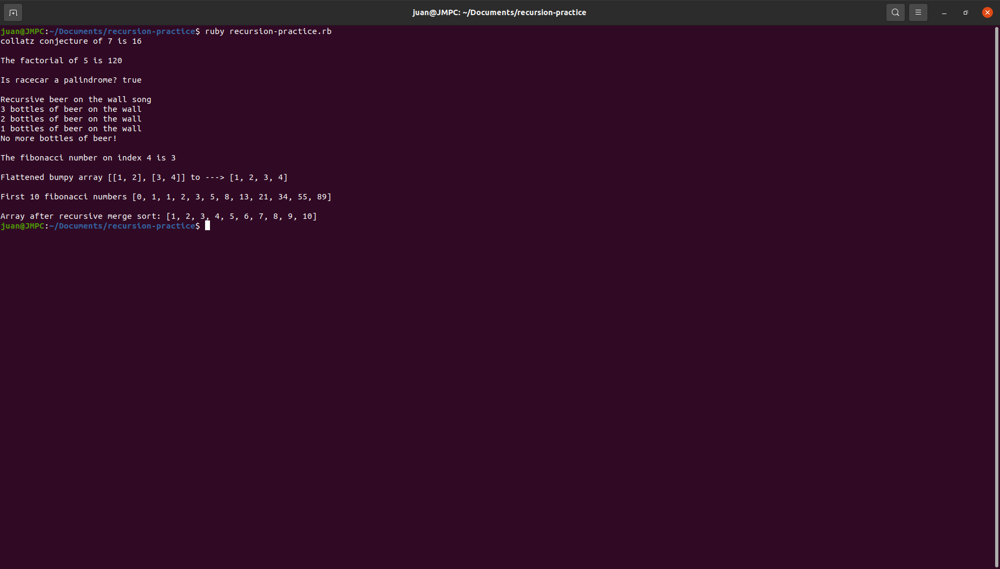

Quick recursion practice using ruby.

Copy and paste the source code into a ruby sandbox like: https://replit.com/languages/Ruby

OR

Run the project locally (prerequisites: ruby):

1. Download or clone the repository.
2. Open the terminal inside the root of the project and run:
3. ruby recursion-practice.rb
